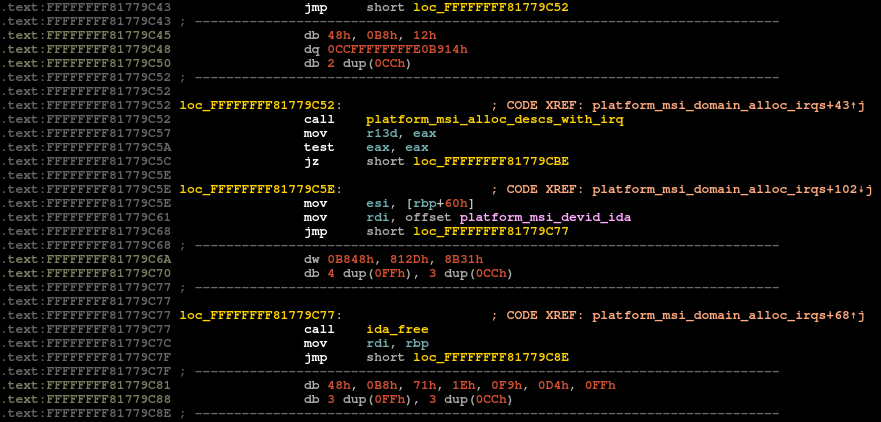
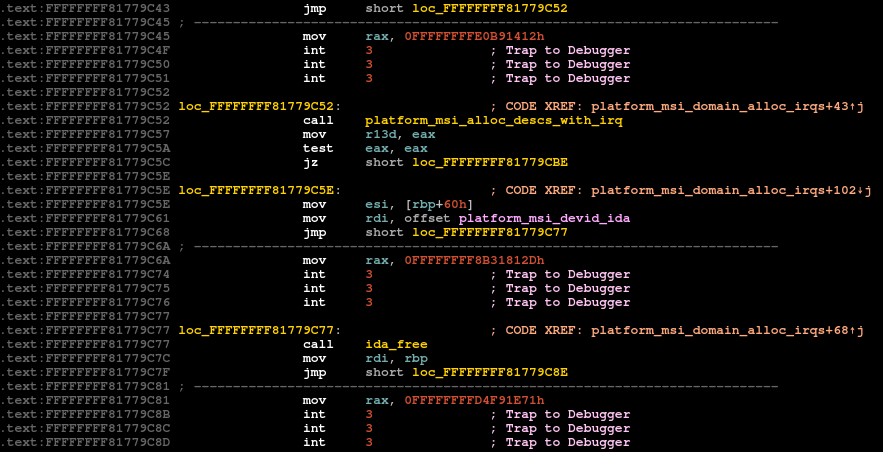

About
=====

This is an IDA Pro (Interactive Disassembler) plugin allowing to automatically analyze code following JMP instructions. By default IDA considers this code to be just an alignment and ignores it. However, for example when the kernel is compiled with RAP plugin, disassembling these instructions improves readability.

Requirements
============

This is an IDAPython-based plugin supporting IDA Pro 7.x with Python 3.

Currently only `x86/x86_64` architecture is supported.

Installation
============

## System-wide installation:

Copy `rap_decode.py` file into your `IDADIR/plugins` directory:

| OS      | Typical global plugins directory path       |
| ------- | ------------------------------------------- |
| Windows | `%ProgramFiles%\IDA Pro 7.x\plugins`       |
| macOS   | `/Applications/IDA Pro 7.x/idabin/plugins`  |
| Linux   | `/opt/idapro-7.x/plugins`                   |

Where `x` should be the actual version number installed.

## User installation:

Copy `rap_decode.py` file into your local user IDA plugins directory:

| OS          | Typical user plugins directory path  |
| ----------- | ------------------------------------ |
| Windows     | `%AppData%\Hex-Rays\IDA Pro\plugins` |
| Linux/macOS | `~/.idapro/plugins`                  |

Usage
=====

To use the plugin click `RAP Decode` entry from the `Edit / Plugins` menu bar. Alternatively, invoke the plugin with a shortcut `Alt + F8`.

What does it do?
================

Upon invocation the plugin iterates over all functions' basic blocks and identifies data areas directly following JMP instructions.
Each such data area is then turned into code and re-analyzed.

Example
=======

Before                       | After
:---------------------------:|:--------------------------:
 | 
